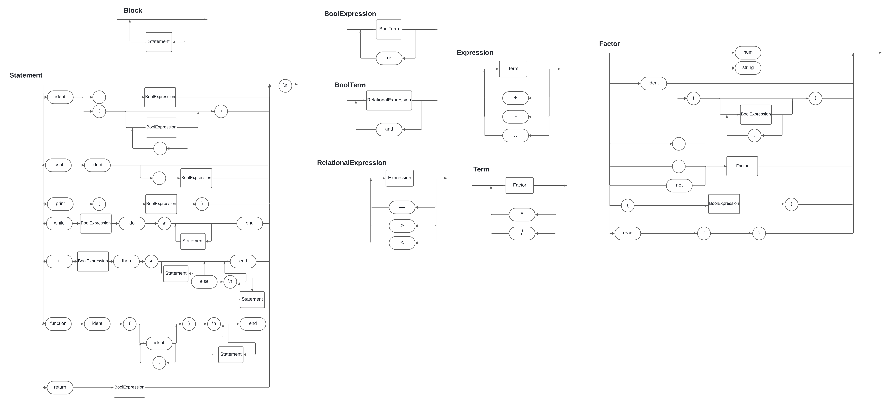

# CompiladorComp





## EBNF

```ebnf
BLOCK = { STATEMENT };
STATEMENT = ( "λ" | ASSIGNMENT | LOCAL | PRINT | WHILE | IF ), "\n" ;
ASSIGNMENT = IDENTIFIER, "=", EXPRESSION ;
LOCAL = "local", IDENTIFIER, ("λ" | ("=", BOOL_EXP));
PRINT = "print", "(", EXPRESSION, ")" ;
WHILE = "while", BOOL_EXP, "do", "\n", "λ", { ( STATEMENT ), "λ" }, "end";
IF = "if", BOOL_EXP, "then", "\n", "λ", { ( STATEMENT ), "λ" }, ( "λ" | ( "else", "\n", "λ", { ( STATEMENT ), "λ" })), "end" ;
BOOL_EXP = BOOL_TERM, { ("or"), BOOL_TERM } ;
BOOL_TERM = REL_EXP, { ("and"), REL_EXP } ;
REL_EXP = EXPRESSION, { ("==" | ">" | "<"), EXPRESSION } ;
EXPRESSION = TERM, { ("+" | "-" | ".."), TERM } ;
TERM = FACTOR, { ("*" | "/"), FACTOR } ;
FACTOR = NUMBER | STRING | IDENTIFIER | (("+" | "-" | "not"), FACTOR ) | "(", EXPRESSION, ")" | "read", "(", ")" ;
IDENTIFIER = LETTER, { LETTER | DIGIT | "_" } ;
NUMBER = DIGIT, { DIGIT } ;
STRING = '"', { LETTER | DIGIT }, '"' ;
LETTER = ( "a" | "..." | "z" | "A" | "..." | "Z" ) ;
DIGIT = ( "1" | "2" | "3" | "4" | "5" | "6" | "7" | "8" | "9" | "0" ) ;
```


